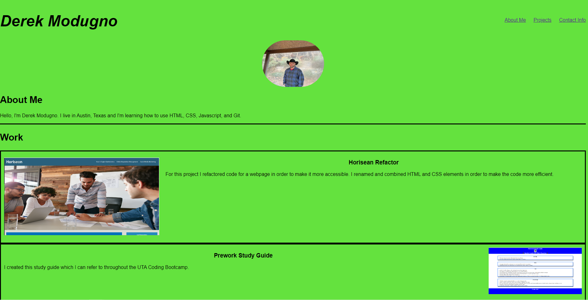

# Professional Portfolio

## Description

- My motivation for this project was to create a website from scratch.
- I created this project so that I could have a webpage that shows potential employers my work portfolio.
- This website allows me to tell employers about me and to show links to multiple projects on one page.
- This project taught me how to create a responsive website with working  links.

## Installation

N/A

## Usage

This webpage shows my professional portfolio with links to my projects and information about myself.

https://derekm129.github.io/myPortfolio/

## Credits

N/A

## License

Please refer to the license in the repo.

---

